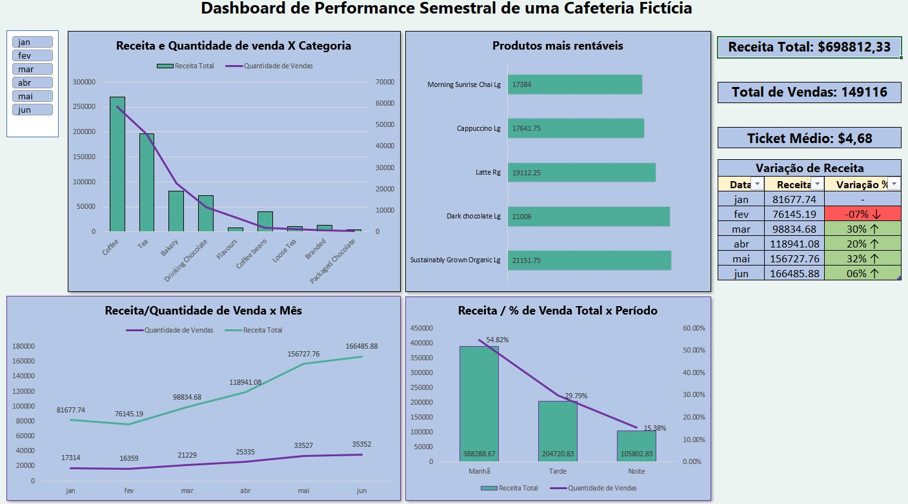
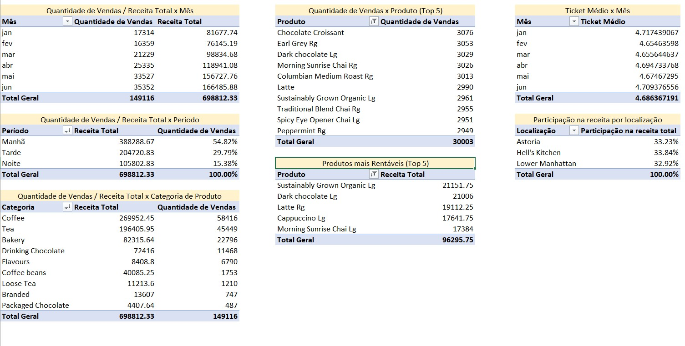

# Análise de Performance Semestral – Cafeteria Fictícia

## Descrição

Este projeto consiste em uma análise de desempenho de vendas de uma cafeteria fictícia ao longo de 6 meses. O objetivo principal foi aplicar conceitos de análise de dados utilizando exclusivamente o **Microsoft Excel**, ferramenta que estou focando nos meus estudos iniciais em Ciência de Dados.  

A análise contempla visualizações interativas, indicadores de performance (KPIs) e insights extraídos a partir de dados simulados.

## Objetivos

- Praticar manipulação e organização de dados no Excel.
- Criar dashboards com segmentações e visualizações relevantes.
- Identificar padrões de comportamento nas vendas e gerar insights de negócio.
- Comunicar resultados de forma clara por meio de gráficos e relatório escrito.

## Fonte dos Dados

Os dados utilizados neste projeto foram obtidos da plataforma Kaggle:  
[Coffee Sales Dataset – por Ahmed Abbas](https://www.kaggle.com/datasets/ahmedabbas757/coffee-sales)

## Preparação dos Dados

Antes da criação das tabelas dinâmicas e do dashboard, foram realizadas duas transformações fundamentais na base de dados original:

1. **Criação da coluna “Período do Dia”**  
   Utilizando a função `SE`, foi adicionada uma nova coluna classificando o horário de cada venda em:
   - **Manhã**: das 07h00 até 11h59  
   - **Tarde**: das 12h00 até 16h59  
   - **Noite**: das 17h00 até 20h00  

   Essa categorização permitiu analisar padrões de consumo ao longo do dia.

2. **Criação da coluna “Total_Transação”**  
   Foi criada uma coluna calculando o valor total de cada item vendido, por meio da multiplicação:  
   `Preço do item × Quantidade de itens`  

   Essa coluna foi usada como base para todos os cálculos de receita total e rankings de rentabilidade.

## Estrutura do Projeto

```bash
projeto_excel_coffeeshop/
│
├── README.md
│
├── data&dashboard/
│   └── coffee_sales_dashboard.xlsx
│
├── report/
│   └── insights_coffee_sales.docx
│
└── screenshots/
    ├── dashboard.jpg
    └── tabelas_dinamicas.jpg
```

* coffee_sales_dashboard.xlsx: contém a base de dados, colunas calculadas, tabelas dinâmicas e o dashboard final.

* insights_coffee_sales.docx: relatório escrito com os principais achados da análise.

* screenshots/: imagens ilustrativas do dashboard e das tabelas dinâmicas.

## Visualizações
- Dashboard - Visão Geral



- Tabelas dinâmicas


## Principais Insights
- Receita total no período: $698.812,33

- Total de vendas: 149.116

- Ticket médio: $4,68

- Crescimento de receita de 104% entre janeiro e junho, impulsionado pelo aumento no volume de vendas.

- Ticket médio permaneceu estável, indicando que o crescimento veio de maior volume e não de aumento no gasto por cliente.

- Período da manhã concentrou 54% das vendas totais.

- Produtos mais rentáveis:
Sustainably Grown Organic Rg, Dark Chocolate Lg, Latte Rg, Capuccino Lg, Morning Sunrise Chai Lg.

- Participação de receita praticamente igual entre as três localizações (Astoria, Hell's Kitchen, Lower Manhattan).

- Observou-se uma queda recorrente na receita nos dias finais de cada mês (27 a 29), em média 29%, o que sugere necessidade de investigação sobre a causa.

## Ferramentas Utilizadas
- Microsoft Excel

    - Tabelas dinâmicas

    - Segmentação de dados

    - Gráficos dinâmicos

    - Fórmulas e colunas calculadas

- Microsoft Word (para documentação dos insights)

## Próximos Passos
Este é o primeiro projeto faz parte de uma série voltada ao aprendizado prático em análise de dados. Os próximos projetos terão foco em:

- Power BI (dashboard interativo)

- SQL (consultas e modelagem de dados relacionais)

- Python (análises estatísticas e automações)

- Projeto final integrando todas as ferramentas